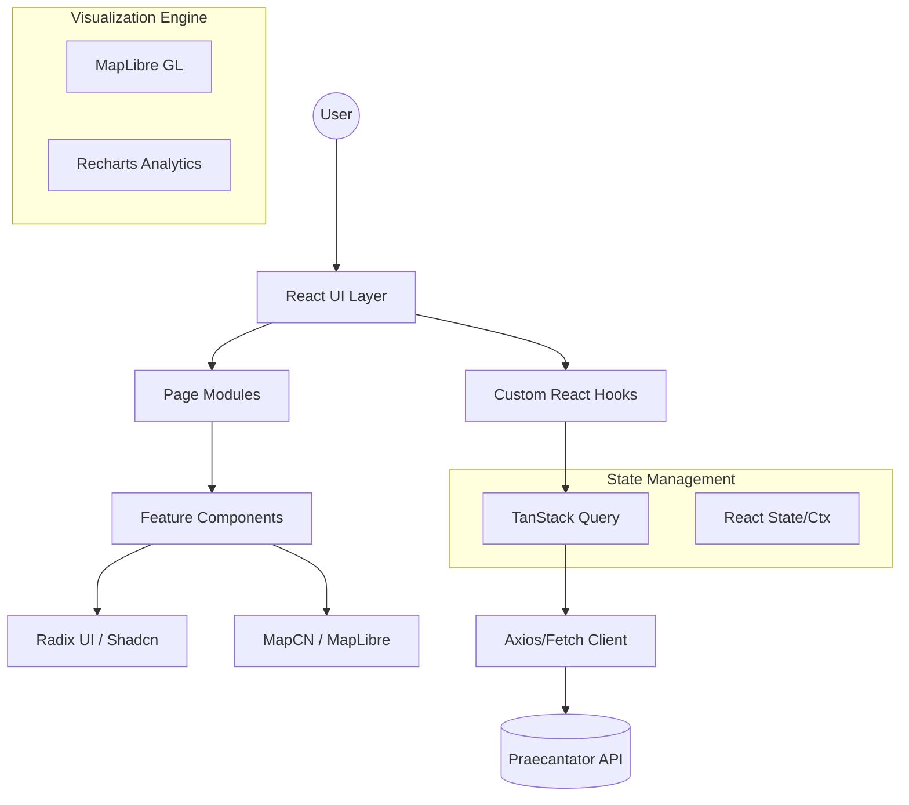
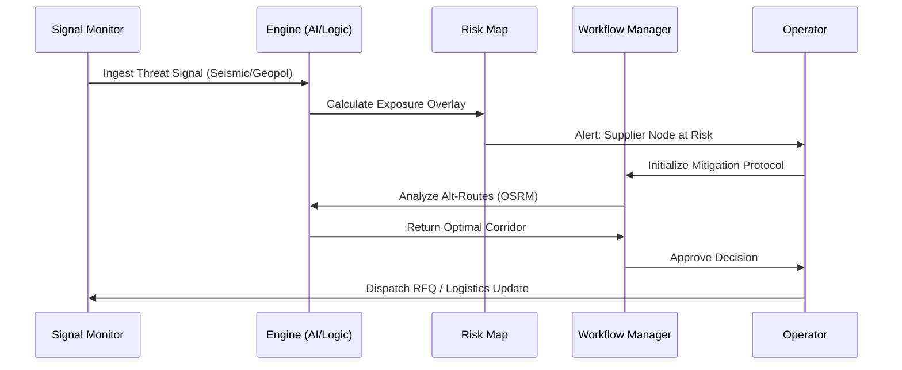

# Praecantator - Kinetic Fortress

Praecantator is a high-performance, real-time supply chain monitoring and risk mitigation dashboard. It provides a "Kinetic Fortress" for enterprise logistics, enabling operational visibility, automated workflows, and advanced risk analysis through a map-centric intelligence interface.

## 🚀 Overview

The frontend is built for speed, precision, and reliable data visualization. It integrates global risk feeds with internal logistics data to provide a unified operational nexus.

### Core Modules

- **Operational Nexus (Dashboard)**: Real-time monitoring of KPIs, active risk events, and high-priority exposure nodes.
- **Risk Map**: A globe-projected intelligence interface using @mapcn/heatmap to visualize risk density (earthquakes, geopolitics, etc.) alongside supplier locations.
- **Route Intelligence**: Dynamic corridor optimization using OSRM routing and MapCN tracking to monitor cargo in transit across Sea, Land, and Air.
- **Workflow Engine**: Automated decision-support system for managing operational deltas and supply chain disruptions.
- **RFQ Manager**: Integrated procurement and request-for-quote handling.
- **Signal Monitor**: Real-time signal intelligence monitoring for supply chain anomalies.

## 🏛 Frontend Architecture

Praecantator utilizes a modern, decoupled architecture designed for high-frequency data updates and complex spatial visualizations.

### High-Level Component Diagram



### Architectural Decisions

- **Atomic Design Consistency**: Leveraging Shadcn UI over Radix primitives ensures a consistent design language while maintaining full accessibility (ARIA compliant).
- **Reactive Data Layer**: TanStack Query manages the transition between server-side truth and client-side UI, handling caching, revalidation, and optimistic updates.
- **Spatial First**: Maps are treated as primary interface elements, not just overlays, utilizing MapLibre for vector tile performance.

## 🔄 Operational Workflow

Praecantator follows a rigid **OODA Loop** (Observe, Orient, Decide, Act) adapted for supply chain resilience.

### Sequence Diagram: Incident Response



### Response Lifecycle

1.  **DETERMINATION**: Global signals (geopolitical events, natural hazards, news) are ingested via the **Signal Monitor**.
2.  **QUANTIFICATION**: The **Risk Map** and **Exposure Score** modules calculate the mathematical impact on multi-tier supplier nodes.
3.  **STRATEGY**: The **Workflow Engine** evaluates mitigation options (e.g., rerouting cargo, switching suppliers) using AI-assisted analysis.
4.  **EXECUTION**: Integrated **RFQ Manager** triggers procurement actions, while **Route Intelligence** executes corridor optimization via OSRM.
5.  **VALIDATION**: Every decision and execution record is persisted in the **Audit Log** for compliance and performance review.

## 🛠 Tech Stack

- **Core**: React 18, TypeScript 6.
- **Build Tool**: Vite 8.
- **Styling**: Tailwind CSS 4, Lucide Icons.
- **UI Components**: Shadcn UI (Radix UI primitives).
- **Mapping & Visualization**:
  - MapLibre GL
  - MapCN Components (@mapcn/logistics-network, @mapcn/heatmap, @mapcn/delivery-tracker)
  - Recharts for data analytics.
- **State Management & Data Fetching**: React Query (TanStack Query).
- **Form Handling**: React Hook Form + Zod validation.
- **Routing**: React Router DOM 6.

## 🏗 Project Structure

- `src/app/logistics`: Specialized logistics components and network data.
- `src/components/ui`: Atomic UI components (Shadcn + MapCN).
- `src/pages/dashboard`: Primary intelligence modules and views.
- `src/hooks`: Custom React hooks for dashboard data and state.
- `src/lib`: API clients and utility functions.

## 📦 Getting Started

### Prerequisites

- Node.js (Latest LTS recommended)
- npm or yarn

### Installation

1.  Install dependencies:

    ```bash
    npm install
    ```

2.  Configure environment:
    Create a `.env` file in the root:

    ```env
    VITE_API_BASE_URL=http://localhost:5000
    ```

3.  Start development server:

    ```bash
    npm run dev
    ```

## 🔒 Security & Standards

- **Strict Linting**: Configured with ESLint and TypeScript for code quality.
- **ARIA Compliance**: Implements accessible patterns for all interactive components.
- **Style Enforcement**: Uses utility-first CSS via Tailwind to avoid technical debt.
